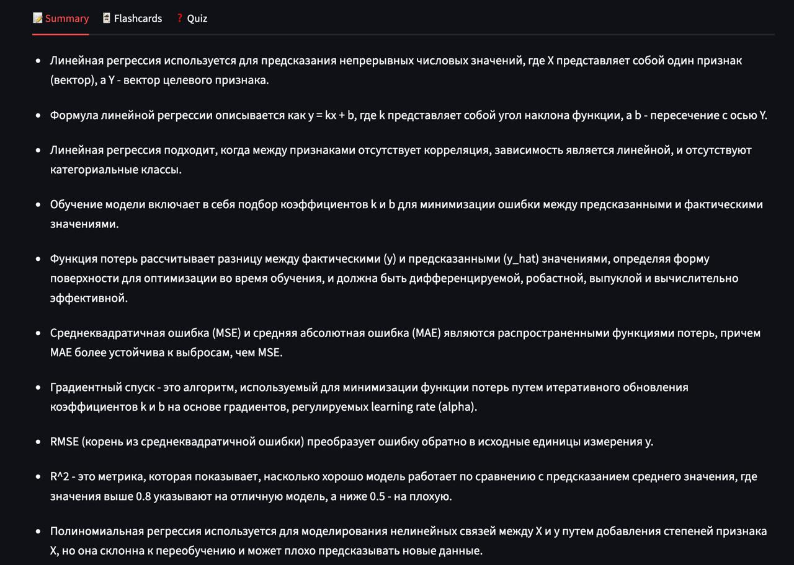
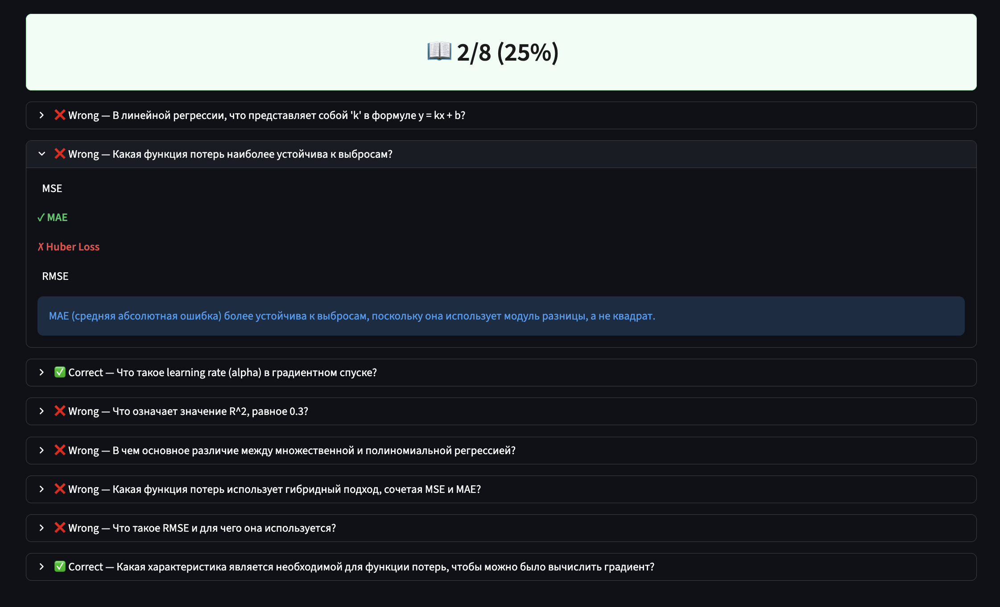

# StudyMate — AI-ассистент для учёбы

Загрузи лекцию (PDF, DOCX, TXT) и получи **конспект**, **флеш-карточки** и **тест** одним нажатием — на базе локальной LLM через Ollama.



## Как это работает

Три AI-агента обрабатывают текст параллельно:

| Агент | Результат |
|---|---|
| SummaryAgent | 7–10 ключевых тезисов |
| FlashcardAgent | 10–15 карточек «вопрос — ответ» |
| QuizAgent | 5–8 вопросов с вариантами ответов и объяснениями |

Результаты сохраняются в SQLite и доступны через боковую панель с историей сессий.

 

## Стек

- **Бэкенд** — FastAPI + SQLAlchemy (async, SQLite)
- **Агенты** — LangGraph state graph, параллельный запуск через `asyncio.gather`, Ollama (`gemma3:4b`)
- **Парсинг** — pdfplumber (PDF), python-docx (DOCX), встроенный decode (TXT)
- **Фронтенд** — Streamlit
- **Наблюдаемость** — логи loguru, метрики Prometheus на `/metrics`
- **Изоляция** — Docker + docker-compose

## Запуск локально

**Требования:** Python 3.12+, [uv](https://docs.astral.sh/uv/), [Ollama](https://ollama.com) с загруженной моделью `gemma3:4b`.

```bash
# установить зависимости
uv sync

# загрузить модель (один раз)
ollama pull gemma3:4b

# терминал 1 — бэкенд
uv run uvicorn app.main:app --reload

# терминал 2 — фронтенд
uv run streamlit run frontend/app.py
```

Открыть **http://localhost:8501**

## Запуск через Docker

```bash
docker compose up --build

# только при первом запуске — загрузить модель внутри контейнера
docker compose exec ollama ollama pull gemma3:4b
```

| Сервис | URL |
|---|---|
| Фронтенд | http://localhost:8501 |
| Backend API | http://localhost:8000 |
| Метрики Prometheus | http://localhost:8000/metrics |

## Запуск тестов

```bash
uv run pytest tests/ -v
```

17 юнит-тестов, все вызовы LLM замоканы 

## Структура проекта

```
app/
├── main.py              # FastAPI маршруты + lifespan
├── config.py            # настройки через переменные окружения
├── schemas.py           # Pydantic-модели
├── agents/
│   ├── base.py          # общий LLM-клиент + call_llm()
│   ├── graph.py         # оркестратор (параллельный asyncio.gather)
│   ├── state.py         # StudyMateState TypedDict
│   ├── summary.py
│   ├── flashcard.py
│   └── quiz.py
├── parsers/             # извлечение текста из PDF / DOCX / TXT
└── storage/             # SQLAlchemy-модели + async-сессия
frontend/
└── app.py               # интерфейс Streamlit
tests/
└── test_agents.py       # юнит-тесты с замоканным LLM
data/                    # том SQLite (Docker)
media/                   # скриншоты
```

## Переменные окружения

| Переменная | По умолчанию | Описание |
|---|---|---|
| `OLLAMA_BASE_URL` | `http://localhost:11434/v1` | Адрес Ollama API |
| `OLLAMA_API_KEY` | `ollama` | API-ключ (Ollama игнорирует, SDK требует) |
| `LLM_MODEL` | `gemma3:4b` | Название модели |
| `DATABASE_URL` | `sqlite+aiosqlite:///./studymate.db` | Строка подключения к БД |
| `MAX_FILE_SIZE_MB` | `10` | Лимит размера загружаемого файла |
