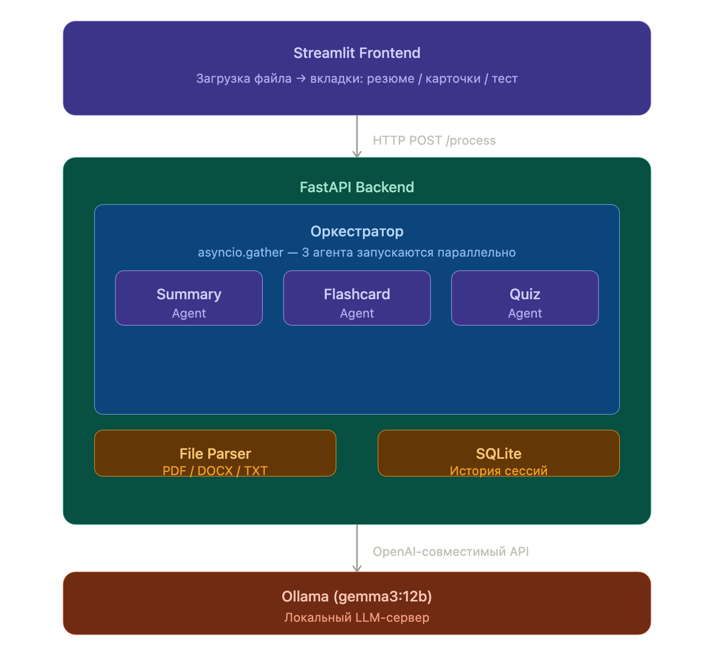
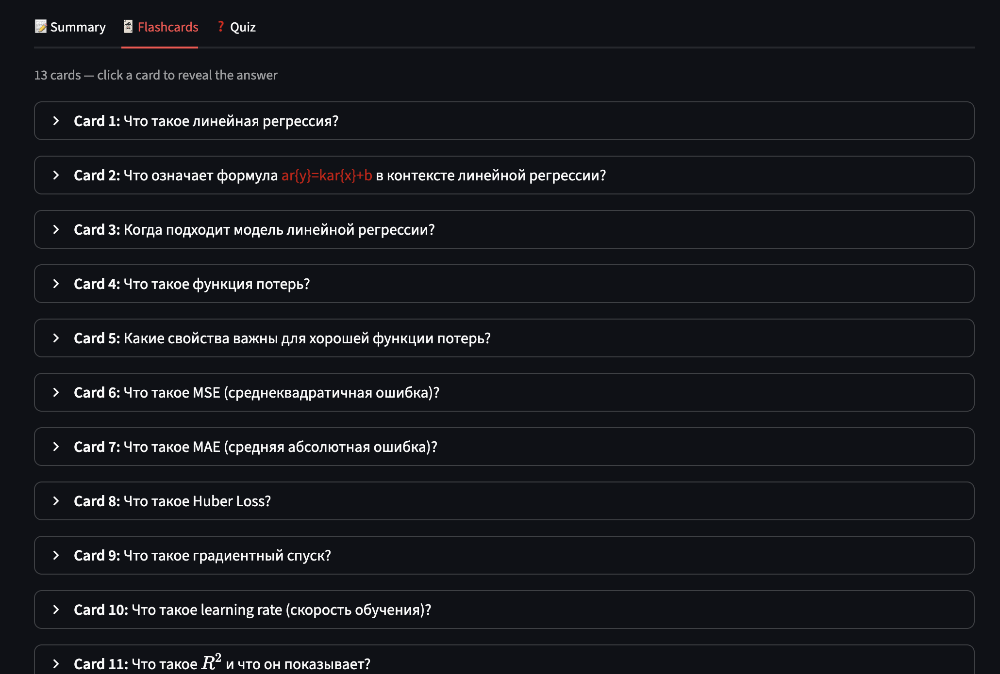
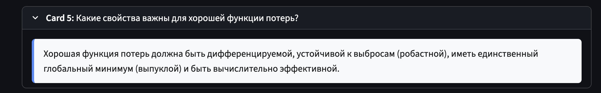
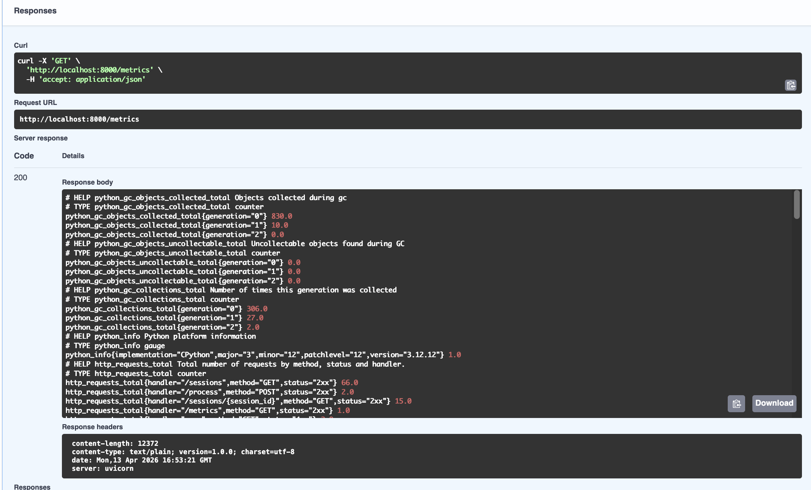

# Мультиагентная система StudyMate

**Репозиторий:** (https://github.com/Kushon/StudyMate)

**Стек:** Python 3.12 · FastAPI · LangGraph · Ollama (gemma3:12b) · Streamlit · SQLite · Docker

---

## 1. Описание продукта и ТЗ под агента

**StudyMate** — веб-приложение для подготовки к экзаменам. Пользователь загружает конспект или слайды лекции (PDF, DOCX, TXT), а система автоматически возвращает:

- краткое резюме ключевых тезисов;
- набор флеш-карточек «вопрос — ответ»;
- тест с вариантами ответов и объяснениями.

**ТЗ на агентную систему:**

| Агент | Вход | Выход |
|---|---|---|
| SummaryAgent | извлечённый текст лекции | список из 7–10 тезисов |
| FlashcardAgent | извлечённый текст лекции | список из 10–15 карточек `{вопрос, ответ}` |
| QuizAgent | извлечённый текст лекции | список из 5–8 вопросов MCQ `{вопрос, 4 варианта, правильный индекс, объяснение}` |

Все три агента работают **параллельно** под управлением оркестратора. Результат сохраняется в базу данных и доступен в истории сессий.

---

## 2. Архитектура мультиагентной системы

### Выбор архитектурного паттерна

Рассматривались следующие паттерны:

| Паттерн | Описание | Применимость |
|---|---|---|
| **Orchestrator** | Центральный узел вызывает агентов, собирает результаты | Выбран |
| Pipeline | Агенты передают контекст по цепочке | Не подходит: агенты независимы, порядок не важен |
| Blackboard | Агенты читают/пишут в общее хранилище | Избыточно для трёх узлов |
| Peer-to-peer | Агенты общаются напрямую | Нет необходимости в межагентной коммуникации |

Выбран **Orchestrator pattern**: центральный модуль (`graph.py`) запускает три агента через `asyncio.gather`, собирает их вывод в единый объект состояния и возвращает результат. Это минимизирует связность: каждый агент знает только о своём входе и выходе, ничего не знает об остальных.

### Схема системы




### вкладка Summary с результатами


### вкладка Flashcards




### вкладка Quiz с результатами после ответов


---

## 3. Выбор стека и аргументы

### Язык и среда выполнения

**Python 3.12** выбран как доминирующий язык в ML/AI-экосистеме. Управление зависимостями — **uv** (в 10–100× быстрее pip, встроенная поддержка виртуальных окружений).

### Оркестрация агентов: LangGraph

**LangGraph** — библиотека для построения агентных систем на основе направленных графов состояний. Рассматривались альтернативы:

| Фреймворк | Плюсы | Минусы |
|---|---|---|
| **LangGraph** | Граф состояний, поддержка параллелизма, интеграция с экосистемой LangChain | Дополнительная абстракция |
| CrewAI | Высокоуровневый, ролевая модель агентов | Меньше контроля над потоком |
| AutoGen | Диалоговые агенты, хорошо для итеративных задач | Избыточен для одиночного запроса |
| Кастомный оркестратор | Полный контроль, нет зависимостей | Больше кода, нет встроенного state management |

Выбран **LangGraph** + `asyncio.gather` для параллельного запуска узлов. Состояние системы описывается через `TypedDict`:

```python
class StudyMateState(TypedDict):
    text:       str
    summary:    list[str]
    flashcards: list[Flashcard]
    quiz:       list[QuizQuestion]
```

### LLM: Ollama + gemma3:12b

Требование задания — опенсорсная модель. Рассматривались варианты:

| Вариант | Плюсы | Минусы |
|---|---|---|
| **Ollama (локально)** | Бесплатно, приватность данных, OpenAI-совместимый API | Зависит от железа, медленнее |
| Hugging Face Inference API | Бесплатный tier, много моделей | Ограничения по частоте запросов |
| vLLM | Высокая производительность | Сложная настройка |
| llama.cpp напрямую | Максимальная скорость | Нет REST API из коробки |

Выбран **Ollama** — предоставляет OpenAI-совместимый REST API (`/v1/chat/completions`), что позволяет использовать официальный `openai` Python SDK без изменений. Модель **gemma3:12b** (Google, Apache 2.0) показала лучшее качество генерации русскоязычных учебных материалов среди доступных моделей.

### Бэкенд: FastAPI

FastAPI выбран за асинхронную природу (важно для параллельных вызовов к LLM), автоматическую генерацию OpenAPI-документации и нативную интеграцию с Pydantic для валидации данных.

### Фронтенд: Streamlit

Streamlit позволяет строить интерактивные веб-приложения на чистом Python без JavaScript. Для учебного проекта это оптимально — весь стек остаётся в одном языке. Альтернативы (React, Vue) потребовали бы отдельного фронтенд-проекта.

### Парсинг файлов

| Формат | Библиотека | Причина |
|---|---|---|
| PDF | pdfplumber | Точнее PyPDF2 на сложных макетах, корректно обрабатывает многоколоночный текст |
| DOCX | python-docx | Официальная библиотека для формата Open XML, поддерживает таблицы |
| TXT | built-in | Встроенный decode() достаточен |

---

## 4. Изоляция среды выполнения

### Рассмотренные варианты

| Вариант | Плюсы | Минусы |
|---|---|---|
| **Docker + docker-compose** | Воспроизводимость, лёгкость деплоя, поддержка всех платформ | Накладные расходы на образ |
| VM (VirtualBox, VMware) | Полная изоляция ОС | Тяжёлый, медленный старт |
| Sandbox (gVisor, Firecracker) | Высокая безопасность | Избыточно для этой задачи |
| Python venv | Изоляция зависимостей | Нет изоляции ОС и сети |
| Conda | Управление зависимостями | Не изолирует на уровне ОС |

### Выбор: Docker + docker-compose

Выбрана **контейнеризация через Docker** по следующим причинам:

1. Воспроизводимая среда: контейнер запускается одинаково на любой машине.
2. Изоляция на уровне ОС: каждый сервис (ollama, backend, frontend) в своём контейнере с отдельной файловой системой и сетью.
3. docker-compose позволяет описать всю систему в одном файле и управлять зависимостями между сервисами через `healthcheck`.
4. Официальный образ `ollama/ollama` позволяет развернуть LLM-сервер одной командой.

Система состоит из трёх контейнеров:

```
docker-compose
├── ollama    — LLM-сервер, named volume для моделей
├── backend   — FastAPI, зависит от ollama (healthcheck)
└── frontend  — Streamlit, зависит от backend (healthcheck)
```

---

## 5. Системные промпты и скиллы агентов

Каждый агент реализован как отдельный Python-модуль с двумя промптами: системным (роль агента) и пользовательским (конкретная задача + формат вывода).

### SummaryAgent — системный промпт

```
You are a study assistant that helps university students prepare for exams.
Your job is to read lecture material and extract the most important thesis points.
Always respond with valid JSON.
```

Пользовательский промпт требует вернуть JSON-объект `{"points": [...]}` с 7–10 тезисами в виде полных предложений на языке оригинала.

### FlashcardAgent — системный промпт

```
You are a study assistant that helps university students prepare for exams.
Your job is to create flashcards from lecture material.
Always respond with valid JSON.
```

Пользовательский промпт требует вернуть `{"flashcards": [{"question": "...", "answer": "..."}]}`.

### QuizAgent — системный промпт

```
You are a study assistant that helps university students prepare for exams.
Your job is to create multiple choice quiz questions from lecture material.
Always respond with valid JSON.
```

Пользовательский промпт требует вернуть `{"quiz": [{"question": "...", "options": [...], "correct_index": 0, "explanation": "..."}]}`.


## 6. Система организации памяти

### Рассмотренные варианты

| Вариант | Описание | Плюсы | Минусы |
|---|---|---|---|
| **SQLite (выбран)** | Реляционная БД в файле | Нет отдельного сервера, ACID, простота | Не масштабируется на несколько инстансов |
| Redis | In-memory хранилище | Очень быстро, TTL из коробки | Требует отдельного сервера, данные volatile |
| ChromaDB (векторная БД) | Хранение эмбеддингов для семантического поиска | Семантический поиск по истории | Избыточно без RAG-пайплайна |
| RAG (Retrieval-Augmented Generation) | Векторный поиск по корпусу лекций | Агент «помнит» материалы прошлых сессий и связывает их | Сложность реализации, нужен embedding-сервис |
| Простой JSON-файл | Запись в файл | Максимальная простота | Нет транзакций, проблемы с конкурентным доступом |

### Выбор: SQLite через SQLAlchemy (async)

Для MVP выбрана **реляционная БД SQLite** — каждая сессия обработки файла сохраняется в таблицу `sessions`:

```
sessions
├── id          TEXT PRIMARY KEY (UUID)
├── filename    TEXT
├── summary     JSON
├── flashcards  JSON
├── quiz        JSON
└── created_at  DATETIME
```

Доступ через **SQLAlchemy с async-драйвером aiosqlite**, что не блокирует event loop FastAPI во время записи.

**Недостатки выбора:** SQLite не поддерживает несколько одновременных пишущих подключений — при горизонтальном масштабировании бэкенда нужно переходить на PostgreSQL. Также нет семантического поиска по содержимому сессий.

**Что можно улучшить:** внедрить **RAG** — при загрузке файла сохранять его эмбеддинги в ChromaDB, чтобы агенты могли обращаться к релевантным фрагментам из прошлых лекций при генерации карточек. Это особенно полезно для студентов, готовящихся к итоговому экзамену по нескольким темам сразу.

---

## 7. Evals — оценка системы

### Как оценивать LLM в общем случае

| Метод | Описание |
|---|---|
| MMLU, HellaSwag, ARC | Бенчмарки здравого смысла и академических знаний |
| MT-Bench | Многоходовые диалоги, оценка GPT-4 as judge |
| RAGAS | Оценка RAG-систем: faithfulness, relevance, context recall |
| Human eval | Экспертная разметка случайной выборки выходов |

### Как оценивать агентную систему StudyMate

| Метрика | Как измерить | Целевое значение |
|---|---|---|
| **Relevance резюме** | Доля тезисов, реально присутствующих в исходном тексте (human eval выборки) | ≥ 85% |
| **Flashcard quality** | Доля карточек без фактических ошибок (human eval) | ≥ 80% |
| **Quiz correctness** | Доля вопросов с верно указанным `correct_index` (human eval) | ≥ 90% |
| **Latency P95** | Время от загрузки файла до получения результата | ≤ 3 мин (локально) |
| **Parse success rate** | Доля файлов, из которых извлечён непустой текст | ≥ 99% |
| **Agent failure rate** | Доля вызовов, вернувших пустой список после всех retry | ≤ 5% |

Для автоматической оценки качества резюме и карточек можно применить **LLM-as-judge**: отдельный вызов к более сильной модели (например, GPT-4o), которая оценивает пары (исходный текст, сгенерированный контент) по шкале 1–5. Это устраняет необходимость ручной разметки при регрессионном тестировании.

---

## 8. Observability

### Рассмотренные варианты стека

| Компонент | Варианты | Выбор |
|---|---|---|
| Логирование | logging (stdlib), loguru, structlog | **loguru** — минимальная конфигурация, цветной вывод, автоматически добавляет caller info |
| Метрики | Prometheus, StatsD, Datadog | **Prometheus** через `prometheus-fastapi-instrumentator` — бесплатно, self-hosted, стандарт де-факто |
| Трейсы | OpenTelemetry, Jaeger, Zipkin | Не реализовано (см. ниже) |
| Алертинг | Alertmanager, PagerDuty, Grafana Alerts | Не реализовано (см. ниже) |

### Реализовано

**Логирование (loguru)** — структурированные логи во всех агентах и роутах:

```
2026-04-13 18:03:41 | INFO  | app.agents.graph:run_graph:17  - Orchestrator: running agents in parallel
2026-04-13 18:03:41 | INFO  | app.agents.summary:summary_node:30 - SummaryAgent: starting
2026-04-13 18:04:12 | INFO  | app.agents.summary:summary_node:42 - SummaryAgent: done, 9 points
2026-04-13 18:04:19 | INFO  | app.main:process_file:88 - Session saved: d4eeef1c-...
```

**Метрики (Prometheus)** — эндпоинт `/metrics` предоставляет:
- `http_requests_total` — счётчик запросов по методу, статусу и хэндлеру
- `http_request_duration_seconds` — гистограмма латентности по эндпоинтам
- Python GC-статистика



### Не реализовано и почему

**Трейсы (OpenTelemetry):** для полного распределённого трейсинга нужно инструментировать каждый вызов к Ollama, каждый агент и FastAPI, затем настроить collector (Jaeger/Tempo). В рамках MVP это избыточно, но является логичным следующим шагом.

**Алертинг:** требует Prometheus Alertmanager с настройкой правил и каналов уведомлений (email/Telegram/PagerDuty). Для учебного проекта оставлено как улучшение.

---

## 9. Ход работы

Разработка велась итерационно — от минимально работающего ядра к полноценному приложению. Каждый этап заканчивался рабочим, тестируемым состоянием системы.

### Этап 1 — Структура и скелет приложения

Первым делом была заложена архитектурная основа: определена структура папок, созданы все файлы проекта (изначально пустые или с заглушками), настроена база данных.

Параллельно был определён контракт данных: какие именно поля возвращает каждый агент, как выглядит ответ API, что хранится в базе. На этом же этапе подключили базу данных. Выбрали встроенную в Python SQLite — она не требует отдельного сервера, работает как обычный файл на диске, и при этом поддерживает все стандартные операции с данными. Каждая сессия обработки файла (результаты резюме, карточек, теста) автоматически сохраняется туда сразу после генерации.

### Этап 2 — Чтение загруженных файлов

Прежде чем агенты смогут что-то анализировать, нужно извлечь текст из загруженного файла. Это не тривиальная задача: PDF, Word-документы и текстовые файлы устроены принципиально по-разному.

PDF — это не просто текст, а набор инструкций для отображения: где расположить каждый символ, какой шрифт использовать. Для корректного извлечения использовалась библиотека `pdfplumber`, которая понимает внутреннюю структуру PDF и восстанавливает читаемый текст с правильным порядком слов даже в многоколоночных макетах.

Word-документы (DOCX) устроены иначе — это ZIP-архив из XML-файлов. Библиотека `python-docx` умеет их разбирать: она обходит все абзацы и таблицы документа и собирает из них чистый текст.

Дополнительно реализована защита: система проверяет расширение файла и его размер ещё до начала обработки, и возвращает понятное сообщение об ошибке если файл не подходит.

### Этап 3 — Подключение языковой модели и агенты

На этом этапе агенты получили реальные инструкции и научились обращаться к языковой модели.

Каждый агент — это самостоятельный модуль с конкретной специализацией. Агент получает текст лекции, формулирует задачу для языковой модели через промпт, получает ответ и возвращает структурированный результат. Все три агента запускаются одновременно, а не по очереди — это в три раза ускоряет обработку по сравнению с последовательным запуском.

Серьёзной проблемой стало то, что модель иногда возвращала структурно некорректный ответ (подробнее — в разделе «Проблемы»). Для надёжности был добавлен механизм повторных попыток: если первый ответ оказался неприемлемым, агент автоматически делает ещё одну попытку. Если и она не удалась — агент возвращает пустой список, а не роняет всё приложение.

### Этап 4 — Пользовательский интерфейс

Весь интерфейс написан на Python — без использования отдельного языка для веба. Это позволило не переключаться между технологиями и сосредоточиться на логике.

Интерфейс состоит из трёх основных частей:

**Загрузка файла.** Пользователь перетаскивает файл или выбирает его через диалог. Пока модель работает, отображается индикатор прогресса с пояснением, что обработка может занять несколько минут.

**Вкладки с результатами.** После завершения страница обновляется и показывает три вкладки. В «Резюме» — маркированный список ключевых тезисов. В «Карточках» — список сворачиваемых блоков: вопрос виден сразу, ответ открывается по клику. В «Тесте» — вопросы с вариантами ответов; после нажатия «Отправить» отображается итоговый балл и разбор каждого вопроса.

**Панель истории.** Слева отображаются все прошлые сессии из базы данных. Если страница случайно обновилась или закрылась во время долгой обработки, результат не теряется — его можно найти в истории и открыть одним кликом.

### Этап 5 — Изоляция и мониторинг

На финальном этапе система была упакована в контейнеры (Docker) и к ней подключена система наблюдения.

Для мониторинга к серверной части подключена система сбора метрик: количество запросов, время ответа по каждому эндпоинту, системная статистика. Эти данные доступны в стандартном формате, который понимают инструменты визуализации вроде Grafana. Все события внутри системы (запуск агента, результат, ошибка) записываются в структурированные логи с временными метками.

---

## 10. Проблемы и решения

### Проблема 1: языковая модель молчала на сложных задачах

**Суть.** Агент, отвечающий за генерацию тестовых вопросов, стабильно возвращал пустой результат — тогда как агенты резюме и карточек работали нормально на тех же данных.

**Причина.** Когда к языковой модели обращаются с требованием вернуть ответ строго в машиночитаемом формате, небольшие модели вроде gemma3 иногда «теряются»: они не могут одновременно выполнить сложную задачу и удержаться в жёстких рамках формата. В результате модель возвращает пустой ответ вместо того, чтобы попытаться ответить хоть как-то.

**Диагностика.** Тот же вопрос, заданный без требования строгого формата, модель отвечала корректно. Это подтвердило, что дело не в сложности задачи, а именно в конфликте между форматным ограничением и длиной инструкции.

**Решение.** Убрали принудительный режим формата. Вместо этого научили систему самостоятельно находить и извлекать структурированные данные из любого ответа модели — даже если та обернула их в пояснительный текст или оформила как блок кода. Это сделало систему устойчивой к «творческому» поведению модели.

### Проблема 2: три параллельных запроса перегружали локальный сервер модели

**Суть.** Все три агента запускались одновременно. Однако локальный сервер языковой модели (Ollama) обрабатывает запросы по очереди, а не параллельно. При трёх одновременных запросах один из них иногда «выпадал» из очереди и возвращал пустой ответ.

**Решение.** Добавили автоматический повтор: если агент получил пустой или некорректный ответ, он молча повторяет запрос ещё раз. Если и повтор не помог — агент возвращает пустой список вместо того, чтобы сообщать об ошибке и прерывать обработку остальных агентов.

### Проблема 3: долгая обработка — страница обновлялась и результат пропадал

**Суть.** Обработка большого файла занимает несколько минут. Веб-интерфейс поддерживает постоянное соединение с сервером: если браузер засыпает, интернет моргает или пользователь случайно закрывает вкладку — соединение рвётся и данные, которые ещё не успели отобразиться, теряются.

**Решение.** Двойная защита. Во-первых, сервер сохраняет результат в базу данных сразу, как только агенты заканчивают работу — ещё до того, как что-то показывается пользователю. Во-вторых, в интерфейсе есть боковая панель с историей всех прошлых сессий: если результат «исчез», достаточно найти нужный файл в истории и открыть его заново одним кликом.

### Проблема 4: текст карточек не был виден в тёмной теме

**Суть.** Ответная сторона флеш-карточки отображалась пустым белым прямоугольником при включённой тёмной теме браузера.

**Причина.** Карточка была оформлена со светлым фоном, но без явно заданного цвета текста. В светлой теме текст автоматически становится тёмным — и всё читается. В тёмной теме браузер делал текст белым, и он сливался со светлым фоном карточки.

**Решение.** Добавили явный тёмный цвет текста для карточек и блока с результатами теста — теперь они читаются независимо от темы интерфейса.

---

## 11. Семантически наполненные MD-файлы

В проекте созданы следующие документы:

| Файл | Содержание |
|---|---|
| `README.md` | Описание продукта, инструкция по запуску, структура проекта |
| `design_doc.md` | Полный продуктовый дизайн-документ (13 разделов PM-фреймворков) |

